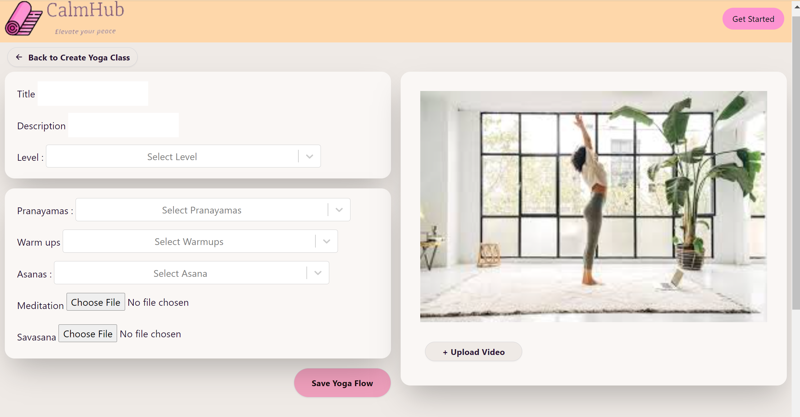

# Getting Started with Yoga create classes App

This app will help yoga teachers to create classes from a large selection of poses/asanas making it ideal to have a plan of your class.

## Tools used
- Reduce DOM
- DaisyUI
- Tailwind
- Backendless
- ion-icons
- React Select

## Example

## Example response
## Features
- create a yoga class with a selection of yoga asanas (postures)
    - upload audio files
    - upload video files [in future]
    - preview, edit and delete an existing yoga flow class
- login, register, reset password,logout for yoga teacher
- see the list of all created yoga classes on Teacher home page

## Contact
  [linkdin:](  my link) 
  : joy

